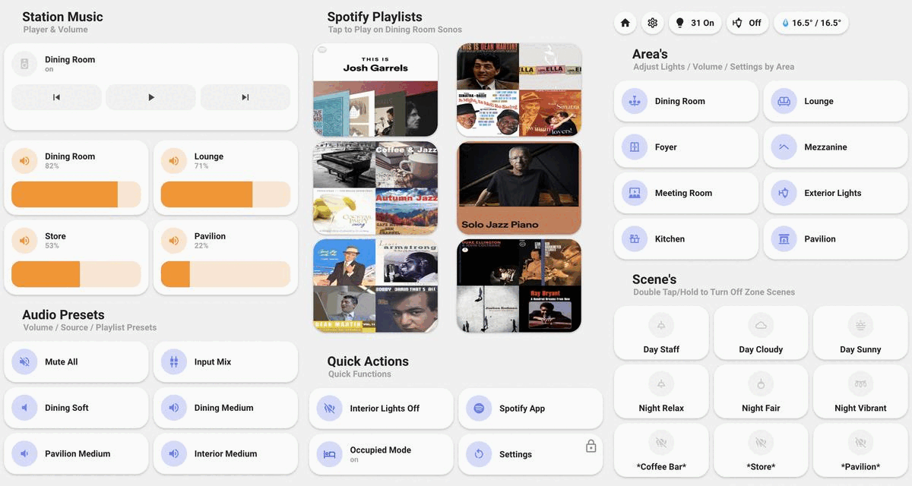

# viewtimeout

[](https://github.com/hacs/integration)

Returns to specified default view after activity
timeout [Home Assistant](https://www.home-assistant.io/)



## Important Info

* If you need to disable the timeout feature temporarily, add `?disable_timeout` to the end of your
  URL.
* Config is placed in the root of your dashboard/panel code: `view_timeout:`

## Dependencies

None required - card tools not required anymore

## Config Options

| Config Option | Type | Default | Description |
|:---------------|:---------------|:---------------|:----------|
|`timeout:`| Boolean | true | enables/disables the timeout feature.
|`default:` | String | home | view to default back to after timeout. Set this to `null` and use `views` to allow for per-view only redirection.
|`duration:` | Number | 15000 | timeout in milliseconds
|`reset:` | Object |  | gives access to activation choices
|`reset.mouse_move` | Boolean | false | resets the timeout when moving the mouse
|`reset.mouse_click` | Boolean | true | resets timeout on mouse click
|`reset.in_lovelace` | Boolean | false | enables timeout only on Lovelace views
|`users:` | Array |  | enable only for certain users (otherwise leave blank)
|`views:` | Object |  | choose view redirection or disable their redirection (with "false")

## Simple config example

```
view_timeout:
  timeout: true
  default: home
  duration: 15000

views:
```

## Targeted config example

```
view_timeout:
  timeout: true
  default: null
  duration: 15000
  views:
    windows: home
    blinds: home

views:
```

## Full config example

```
view_timeout:
  timeout: true
  default: default_view
  duration: 15000
  reset:
    mouse_move: false
    mouse_click: true
    in_lovelace: false
  users:
    - My Username
  views:
    home: false
    first-camera: home
    second-camera: home

views:
```

## TODO

- Per View settings (duration, default to different panel)
- Per User settings (that all settings can be different depending on the user)
